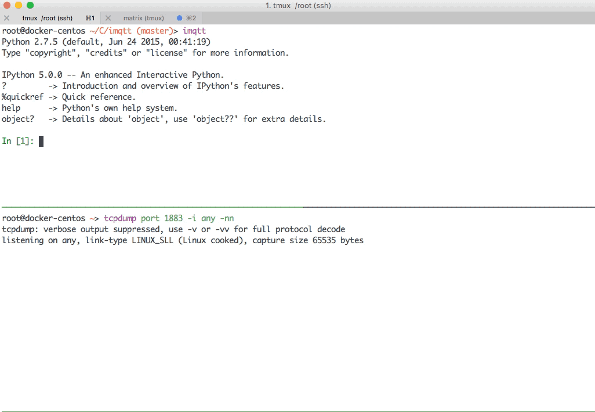

Iteractive MQTT packet manipulation shell based on IPython

You would love it if your are an expert of MQTT and Python



## Installing

```
pip install imqtt
```

## Enter IMQTT shell

```
$ imqtt
```

## Build a TCP Client and connect to mqtt server
```
In [1]: c = TCPClient(host = '127.0.0.1', port = 1883)
('connected to', '127.0.0.1', 1883)
```

## Send a MQTT Connect Packet

```
In [2]: p = ConnectPacket()

In [3]: c.Send(p)
Out[3]: <__main__.TCPClient instance at 0x215c518>
```

## Recv the Connack Packet

```
In [4]: ack = c.Recv()

In [5]: ack
Out[5]: <ConnackPacket <FixedHeader ControlPacketType: 0x2, ControlPacketFlags: 0, RemainingLength: 2>, Flags: 0x1, ReturnCode: 0x0>
```

## Publish a message
```
In [6]: pp = PublishPacket(Topic = '/imqtt/test', Payload = 'Hello world', QoS = 1, PacketID = 1)

In [7]: pp
Out[7]: <PublishPacket <FixedHeader ControlPacketType: 0x3, ControlPacketFlags: 0, RemainingLength: 0>, Dup: 0, QoS: 1, Retain: 0, PacketID: 1, Topic: /imqtt/test, Payload: Hello world>

In [8]: c.Send(pp).Recv()
Out[8]: <PubackPacket <FixedHeader ControlPacketType: 0x4, ControlPacketFlags: 0, RemainingLength: 2>, PacketID: 1>
```

## Working as server mode (version 0.2.2)

### Lisen and serve
```
Welcome to imqtt !
An iteractive MQTT packet manipulation shell based on IPython.
Github: https://github.com/shafreeck/imqtt

In [1]: s = TCPServer(host = '127.0.0.1', port = 1883)
listening on 127.0.0.1 1883

In [2]: s.Serve()
```
### It will break and enter the interactive shell when received a packet
```
Packet received

This is an interactive environment, and being triggered when there was a packet received.
There are some varibles you can use:
 self: the tcp server object
 buf : current data received
 p   : the packet that unmarshaled from buf
Also, all python features are avaliable. Type 'exit()' or press 'Ctrl-D' to quit the shell.
```

### Inspect the received packet and send ack back
```
In [1]: p
Out[1]: <ConnectPacket <FixedHeader ControlPacketType: 0x1, ControlPacketFlags: 0, RemainingLength: 17>,  Protocol: bytearray(b'MQTT'), Version: 4, <Flags UsernameFlag: 0, PasswordFlag: 0, WillRetain: 0, WillQoS: 0, WillFlag: 0, CleanSession: 1>, KeepAlive: 300, ClientID: bytearray(b'imqtt'), Username: , Password: >

In [2]: self.Send(ConnackPacket())
Out[2]: <imqtt.TCPServer at 0x10b890e10>
```

### Exit the shell and continue to serve
```
In [3]: exit()
Continue to serve...
```
